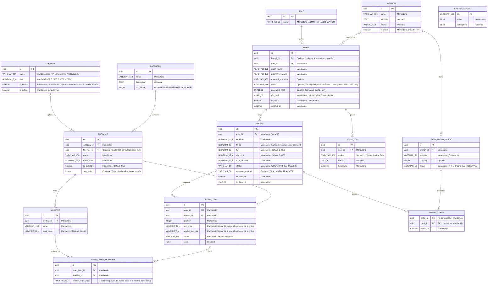

# Diseño de Base de Datos: System POS

Este documento presenta el modelo relacional propuesto para el backend del sistema, enfocado en escalabilidad y trazabilidad. Todos los tipos de columna usan la nomenclatura de **PostgreSQL**.

## Diagrama de Entidad-Relación (ERD)



## Descripción de Módulos (Detalle de Obligatoriedad)

### 1. Sucursales (`BRANCH`)
- Permite que el sistema escale de un único restaurante a una cadena de sucursales sin rediseño.
- `RESTAURANT_TABLE.branch_id` es NOT NULL — toda mesa pertenece a una sucursal.
- `USER.branch_id` es nullable — un Admin puede operar sin sucursal fija (gestiona todas).
- `is_active = False` desactiva una sucursal sin eliminarla.

### 2. Gestión de Datos Maestros
- **Categorías y Productos**: El nombre y precio son siempre obligatorios. La descripción de la categoría es opcional para dar flexibilidad.
- **Modificadores**: El precio extra es obligatorio pero puede ser `0.0000` por defecto.
- **sort_order**: Campo opcional en `CATEGORY` y `PRODUCT` para controlar el orden de visualización en el menú de la tablet. Sin él, el orden quedaría atado al `id` o al momento de inserción.

### 3. Tasas de Impuesto (`TAX_RATE`)
- Almacena los distintos tipos de impuesto aplicables a los productos (ej. IVA 16%, Exento, IVA Reducido 8%).
- `rate` es `NUMERIC(5,4)` entre 0.0000 y 1.0000 (0.1600 = 16%).
- Exactamente una fila debe tener `is_default = TRUE`. Esta unicidad se garantiza a nivel de base de datos mediante un índice parcial único (ver sección de Índices).
- `is_active = False` desactiva una tasa sin eliminarla (preserva integridad referencial con órdenes históricas).
- `PRODUCT.tax_rate_id` es nullable: si es null, el use case resuelve la tasa por defecto en tiempo de ejecución.

### 4. Seguridad y Autenticación
- **PIN (6 dígitos)**: Se utiliza como identificador principal para el login rápido en la terminal POS (Tablets). Se define un PIN de 6 dígitos para permitir hasta 1,000,000 de combinaciones únicas, garantizando escalabilidad y mayor seguridad que un PIN de 4 dígitos.
- **pin_hash**: Siguiendo la Arquitectura Limpia, el PIN nunca se guarda en texto plano; se almacena su hash (`CHAR(60)` para bcrypt).
- **Dual Authentication**: El `email` y `password_hash` se reservan para el acceso administrativo al Dashboard Web, donde se requiere una seguridad más robusta. Ambos son **nullable** — un usuario que solo opera la terminal POS no necesita email ni contraseña.
- **is_active**: Soft delete — nunca se borran usuarios con historial de órdenes o auditoría. Se desactivan con `is_active = FALSE`.

### 5. Operaciones
- **Notas en ítems**: `TEXT`, totalmente opcional, usado para instrucciones especiales a cocina (ej: "sin cebolla").
- **Propinas**: `DEFAULT 0.0000`, permite registrar órdenes sin propina.
- **Descuentos**: `discount NUMERIC(12,4) DEFAULT 0.0000` en `ORDER`. Necesario para almacenar el resultado del `DISCOUNT_APPLIED` del audit log.
- **payment_method**: Nullable mientras la orden está abierta. Se registra al momento del pago para permitir cierre de caja por método de pago.
- **updated_at en ORDER**: Registra la última modificación de la orden, necesario para auditoría y reportes de tiempo de atención.
- **Snapshot de precios e impuestos**: `unit_price` y `applied_tax_rate` en `ORDER_ITEM`, y `applied_extra_price` en `ORDER_ITEM_MODIFIER`, copian los valores vigentes al momento de crear la orden. Garantiza que los tickets históricos sean inmutables ante cambios futuros en el catálogo o en las tasas fiscales.
- **Fórmula de `ORDER.total_amount`**: `subtotal + taxes + tip - discount`. Se calcula en el use case de cierre/pago y se persiste para evitar recálculos.
- **Fórmula de `ORDER.taxes`**: Suma de `(unit_price × quantity × applied_tax_rate)` de todos los `ORDER_ITEM`.
- **ORDER_ITEM.status**: Preparación para KDS (Kitchen Display System). Permite saber el estado de cada ítem sin rediseñar el backend (ver `OrderItemStatus`).
- **Logs de Auditoría**: El campo `details` es `JSONB` — permite queries sobre campos internos (`details->>'order_id'`) y soporta índices GIN.

### 6. Configuración del Sistema (`SYSTEM_CONFIG`)
- Tabla de pares clave-valor para configuración del negocio que no justifica columnas propias.
- Registros iniciales esperados:

| `key` | Ejemplo de `value` | Descripción |
|---|---|---|
| `suggested_tip_1` | `10` | Propina sugerida 1 (%) |
| `suggested_tip_2` | `15` | Propina sugerida 2 (%) |
| `suggested_tip_3` | `20` | Propina sugerida 3 (%) |
| `business_name` | `Restaurante El Sabor` | Nombre del negocio para facturas |
| `business_rfc` | `REST123456ABC` | RFC para facturación |
| `business_address` | `Calle Morelos 42, CDMX` | Dirección fiscal |

---

## Enumeraciones (Enums)

Todos los campos de tipo enum se almacenan como strings en la base de datos (valor legible, no índice numérico) y se validan en la capa de dominio mediante clases `Enum` de Python.

### `RoleName` — `ROLE.name`

| Valor | Descripción |
|---|---|
| `ADMIN` | Acceso total al sistema y al dashboard |
| `MANAGER` | Gestión operativa: reportes, cancelaciones, descuentos |
| `WAITER` | Solo operación de terminal POS: tomar y gestionar órdenes |

---

### `TableStatus` — `RESTAURANT_TABLE.status`

| Valor | Descripción |
|---|---|
| `FREE` | Mesa disponible para ser asignada |
| `OCCUPIED` | Mesa con una orden activa |
| `RESERVED` | Mesa reservada para una llegada futura |

---

### `OrderStatus` — `ORDER.status`

| Valor | Descripción |
|---|---|
| `OPEN` | Orden activa, se pueden agregar/quitar ítems |
| `PAID` | Orden cerrada y pagada |
| `CANCELLED` | Orden anulada (se preserva para auditoría) |

---

### `PaymentMethod` — `ORDER.payment_method`

| Valor | Descripción |
|---|---|
| `CASH` | Pago en efectivo |
| `CARD` | Pago con tarjeta de crédito o débito |
| `TRANSFER` | Transferencia bancaria o pago digital (ej. CoDi, SPEI) |

---

### `OrderItemStatus` — `ORDER_ITEM.status`

| Valor | Descripción |
|---|---|
| `PENDING` | Ítem registrado, pendiente de enviar a cocina |
| `IN_PREPARATION` | Cocina recibió el ítem y está preparándolo |
| `READY` | Ítem listo para ser llevado a la mesa |
| `DELIVERED` | Ítem entregado al cliente |
| `CANCELLED` | Ítem cancelado (se preserva para auditoría) |

---

### `AuditAction` — `AUDIT_LOG.action`

#### Autenticación

| Valor | `details` relevantes |
|---|---|
| `USER_LOGIN` | `{"method": "pin" \| "password"}` |
| `USER_LOGOUT` | — |
| `USER_LOGIN_FAILED` | `{"method": "pin" \| "password", "reason": "..."}` |

#### Gestión de usuarios

| Valor | `details` relevantes |
|---|---|
| `USER_CREATED` | `{"user_id": "...", "given_name": "...", "role": "..."}` |
| `USER_UPDATED` | `{"user_id": "...", "changed_fields": [...]}` |
| `USER_DEACTIVATED` | `{"user_id": "...", "given_name": "..."}` |
| `USER_PIN_CHANGED` | `{"user_id": "..."}` |
| `USER_PASSWORD_CHANGED` | `{"user_id": "..."}` |

#### Catálogo

| Valor | `details` relevantes |
|---|---|
| `CATEGORY_CREATED` | `{"category_id": "...", "name": "..."}` |
| `CATEGORY_UPDATED` | `{"category_id": "...", "changed_fields": [...]}` |
| `PRODUCT_CREATED` | `{"product_id": "...", "name": "...", "base_price": ...}` |
| `PRODUCT_UPDATED` | `{"product_id": "...", "changed_fields": [...]}` |
| `PRODUCT_PRICE_UPDATED` | `{"product_id": "...", "old_price": ..., "new_price": ...}` |
| `PRODUCT_TOGGLED` | `{"product_id": "...", "is_available": true \| false}` |
| `MODIFIER_CREATED` | `{"modifier_id": "...", "product_id": "...", "name": "..."}` |
| `MODIFIER_UPDATED` | `{"modifier_id": "...", "changed_fields": [...]}` |
| `MODIFIER_DELETED` | `{"modifier_id": "...", "name": "..."}` |

#### Tasas de impuesto

| Valor | `details` relevantes |
|---|---|
| `TAX_RATE_CREATED` | `{"tax_rate_id": "...", "name": "...", "rate": ...}` |
| `TAX_RATE_UPDATED` | `{"tax_rate_id": "...", "changed_fields": [...]}` |
| `TAX_RATE_DEACTIVATED` | `{"tax_rate_id": "...", "name": "..."}` |
| `TAX_RATE_DEFAULT_CHANGED` | `{"old_default_id": "...", "new_default_id": "..."}` |

#### Órdenes

| Valor | `details` relevantes |
|---|---|
| `ORDER_CREATED` | `{"order_id": "...", "table_ids": [...]}` |
| `ORDER_ITEM_ADDED` | `{"order_id": "...", "product_id": "...", "quantity": ..., "unit_price": ...}` |
| `ORDER_ITEM_REMOVED` | `{"order_id": "...", "product_id": "...", "quantity": ...}` |
| `ORDER_ITEM_UPDATED` | `{"order_id": "...", "order_item_id": "...", "changed_fields": [...]}` |
| `ORDER_PAID` | `{"order_id": "...", "total_amount": ..., "payment_method": "..."}` |
| `ORDER_CANCELLED` | `{"order_id": "...", "reason": "..."}` |
| `DISCOUNT_APPLIED` | `{"order_id": "...", "amount": ..., "reason": "..."}` |
| `TABLE_ASSIGNED` | `{"order_id": "...", "table_id": "..."}` |
| `TABLE_RELEASED` | `{"order_id": "...", "table_id": "..."}` |

---

## Índices Recomendados

```sql
-- Autenticación rápida
CREATE UNIQUE INDEX ON "user" (email) WHERE email IS NOT NULL;
CREATE UNIQUE INDEX ON "user" (pin_hash);

-- Filtros de operación frecuente
CREATE INDEX ON "order" (status);
CREATE INDEX ON "order" (user_id);
CREATE INDEX ON order_item (order_id);
CREATE INDEX ON restaurant_table (status);
CREATE INDEX ON restaurant_table (branch_id);
CREATE INDEX ON product (category_id);

-- Auditoría y trazabilidad
CREATE INDEX ON audit_log (user_id, timestamp);
CREATE INDEX ON audit_log USING GIN (details);  -- queries sobre campos JSONB internos

-- Restricción de unicidad para tasa por defecto
CREATE UNIQUE INDEX ON tax_rate (is_default) WHERE is_default = TRUE;
```

> El índice parcial en `tax_rate` garantiza a nivel de base de datos que exactamente una fila puede tener `is_default = TRUE`.

---

## Reglas de Integridad Referencial (FK CASCADE/RESTRICT)

| Relación | Regla | Razón |
|---|---|---|
| `ROLE → USER` | `RESTRICT` | No se puede borrar un rol asignado a usuarios |
| `BRANCH → USER` | `SET NULL` | Si se elimina una sucursal, admin queda sin sucursal |
| `BRANCH → RESTAURANT_TABLE` | `RESTRICT` | No se puede borrar sucursal con mesas activas |
| `USER → ORDER` | `RESTRICT` | No se puede borrar usuario con historial de órdenes |
| `USER → AUDIT_LOG` | `RESTRICT` | No se puede borrar usuario con registros de auditoría |
| `ORDER → ORDER_ITEM` | `CASCADE` | Borrar una orden elimina sus ítems |
| `ORDER → ORDER_TABLE` | `CASCADE` | Borrar una orden libera sus asociaciones de mesa |
| `ORDER_ITEM → ORDER_ITEM_MODIFIER` | `CASCADE` | Borrar un ítem elimina sus modificadores |
| `PRODUCT → ORDER_ITEM` | `RESTRICT` | No borrar producto con historial de órdenes |
| `MODIFIER → ORDER_ITEM_MODIFIER` | `RESTRICT` | No borrar modificador con historial |
| `CATEGORY → PRODUCT` | `RESTRICT` | No borrar categoría con productos asignados |
| `TAX_RATE → PRODUCT` | `SET NULL` | Si se borra una tasa, `product.tax_rate_id` queda null → usa la tasa default |

> En PostgreSQL, el comportamiento por defecto de una FK sin `ON DELETE` es `RESTRICT`. Estas reglas deben declararse explícitamente en las migraciones para que sean auto-documentadas.

---

## Notas de Diseño

### Generación de UUIDs
Los UUIDs los genera la **aplicación Python** (`uuid.uuid4()`), no PostgreSQL. Esto permite que el ID de la entidad sea conocido antes del INSERT — requisito de la Arquitectura Limpia, donde la entidad se crea en el dominio antes de persistirse en la infraestructura.

Los modelos ORM pueden especificar `default=uuid.uuid4` en la columna, pero **no** `server_default=gen_random_uuid()`.

### Tipos PostgreSQL usados

| Tipo en diagrama | Tipo real en PostgreSQL | Uso |
|---|---|---|
| `NUMERIC(12,4)` | `NUMERIC(12,4)` | Precios y montos monetarios |
| `NUMERIC(5,4)` | `NUMERIC(5,4)` | Tasas de impuesto (0.0000–9.9999) |
| `VARCHAR(n)` | `VARCHAR(n)` | Strings cortos con longitud máxima conocida |
| `TEXT` | `TEXT` | Strings sin límite definido (notas, direcciones) |
| `CHAR(60)` | `CHAR(60)` | Hashes bcrypt (siempre 60 caracteres) |
| `JSONB` | `JSONB` | JSON binario indexable para `AUDIT_LOG.details` |

> `FLOAT8` (double precision) **no se usa** para valores monetarios — tiene errores de precisión en punto flotante inaceptables para transacciones financieras.

### `ORDER_TABLE` — PK compuesta
La tabla join `ORDER_TABLE` no tiene UUID propio. Su clave primaria es `PRIMARY KEY (order_id, table_id)`, lo que previene duplicados a nivel de base de datos.

### Nombres de campos USER
Los campos de nombre usan terminología en inglés coherente con el dominio:
- `given_name` → nombre de pila
- `paternal_surname` → apellido paterno
- `maternal_surname` → apellido materno (opcional)

Esto evita la confusión de usar `first_name` para referirse a un apellido.

### `USER.email` nullable
El `email` es nullable para ser consistente con `password_hash`: un mesero que solo usa PIN en la terminal POS puede no tener email corporativo. El único mecanismo de unicidad opera sobre valores no-nulos (índice parcial `WHERE email IS NOT NULL`).

### RESTAURANT_TABLE (antes TABLE)
La entidad se nombra `RESTAURANT_TABLE` en lugar de `TABLE` porque `TABLE` es una palabra reservada en SQL estándar y SQLite, lo que causaría errores o requeriría escapado constante en todas las consultas.

### Resolución de tasa de impuesto en tiempo de ejecución
Cuando se agrega un `ORDER_ITEM`, el use case sigue este orden de resolución:
1. Si `product.tax_rate_id` no es null → usa esa tasa.
2. Si es null → busca el `TAX_RATE` con `is_default = TRUE`.
3. Guarda la tasa encontrada en `ORDER_ITEM.applied_tax_rate` (snapshot inmutable).

Esto permite que un producto tenga una tasa específica, o que herede la tasa global del negocio, sin necesidad de configuración explícita en cada producto.

### MODIFIER acoplado a producto
Cada modificador tiene `product_id FK`, lo que significa que modificadores con el mismo nombre para distintos productos son registros separados. Para el alcance actual (MVP) esto es aceptable; una refactorización futura podría introducir un `MODIFIER_GROUP` compartido.

### ROLE sin permisos granulares
Los roles son etiquetas (ADMIN/MANAGER/WAITER). Si en el futuro se necesitan permisos por funcionalidad, se requeriría agregar una tabla de permisos. Para el alcance actual es suficiente.
