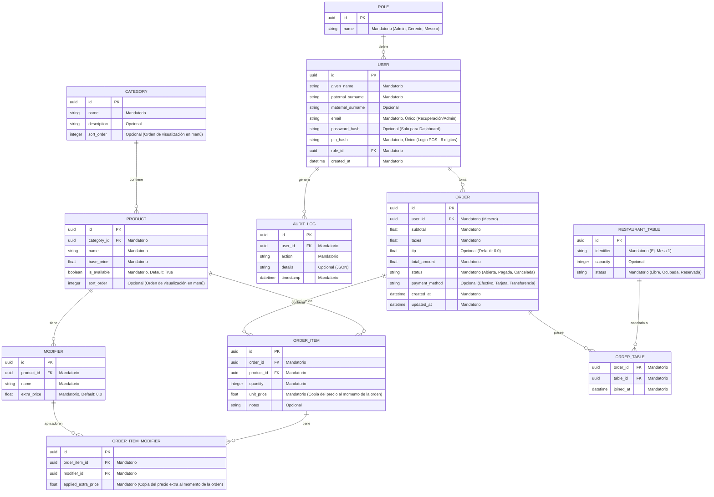

# Diseño de Base de Datos: System POS

Este documento presenta el modelo relacional propuesto para el backend del sistema, enfocado en escalabilidad y trazabilidad.

## Diagrama de Entidad-Relación (ERD)

## Descripción de Módulos (Detalle de Obligatoriedad)

### 1. Gestión de Datos Maestros
- **Categorías y Productos**: El nombre y precio son siempre obligatorios. La descripción de la categoría es opcional para dar flexibilidad.
- **Modificadores**: El precio extra es obligatorio pero puede ser `0.0` por defecto.
- **sort_order**: Campo opcional en `CATEGORY` y `PRODUCT` para controlar el orden de visualización en el menú de la tablet. Sin él, el orden quedaría atado al `id` o al momento de inserción.

### 2. Seguridad y Autenticación
- **PIN (6 dígitos)**: Se utiliza como identificador principal para el login rápido en la terminal POS (Tablets). Se define un PIN de 6 dígitos para permitir hasta 1,000,000 de combinaciones únicas, garantizando escalabilidad y mayor seguridad que un PIN de 4 dígitos.
- **pin_hash**: Siguiendo la Arquitectura Limpia, el PIN nunca se guarda en texto plano; se almacena su hash para protección de datos.
- **Dual Authentication**: El `email` y `password_hash` se reservan para el acceso administrativo al Dashboard Web, donde se requiere una seguridad más robusta. `password_hash` es **nullable** — un usuario que solo opera la terminal POS no necesita contraseña.

### 3. Operaciones
- **Notas en ítems**: Totalmente opcional, usado para instrucciones especiales a cocina (ej: "sin cebolla").
- **Propinas**: Opcional, permitiendo registrar órdenes sin propina pre-cargada.
- **payment_method**: Nullable mientras la orden está abierta. Se registra al momento del pago para permitir cierre de caja por método de pago (efectivo, tarjeta, transferencia).
- **updated_at en ORDER**: Registra la última modificación de la orden, necesario para auditoría y reportes de tiempo de atención.
- **Snapshot de precios**: Tanto `unit_price` en `ORDER_ITEM` como `applied_extra_price` en `ORDER_ITEM_MODIFIER` copian el precio vigente al momento de crear la orden. Esto garantiza que los tickets históricos sean inmutables ante cambios futuros en el catálogo.
- **Logs de Auditoría**: El campo `details` es opcional para acciones simples, pero almacenará cambios complejos en formato JSON cuando sea necesario.

## Notas de Diseño

### Nombres de campos USER
Los campos de nombre usan terminología en inglés coherente con el dominio:
- `given_name` → nombre de pila
- `paternal_surname` → apellido paterno
- `maternal_surname` → apellido materno (opcional)

Esto evita la confusión de usar `first_name` para referirse a un apellido.

### RESTAURANT_TABLE (antes TABLE)
La entidad se nombra `RESTAURANT_TABLE` en lugar de `TABLE` porque `TABLE` es una palabra reservada en SQL estándar y SQLite, lo que causaría errores o requeriría escapado constante en todas las consultas.

### MODIFIER acoplado a producto
Cada modificador tiene `product_id FK`, lo que significa que modificadores con el mismo nombre para distintos productos son registros separados. Para el alcance actual (MVP) esto es aceptable; una refactorización futura podría introducir un `MODIFIER_GROUP` compartido.

### ROLE sin permisos granulares
Los roles son etiquetas (Admin/Gerente/Mesero). Si en el futuro se necesitan permisos por funcionalidad, se requeriría agregar una tabla de permisos. Para el alcance actual es suficiente.
