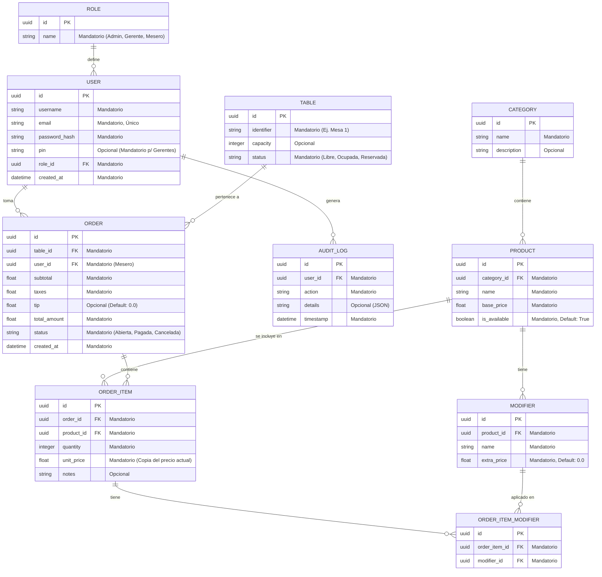

# Diseño de Base de Datos: System POS

Este documento presenta el modelo relacional propuesto para el backend del sistema, enfocado en escalabilidad y trazabilidad.

## Diagrama de Entidad-Relación (ERD)

## Descripción de Módulos (Detalle de Obligatoriedad)

### 1. Gestión de Datos Maestros
- **Categorías y Productos**: El nombre y precio son siempre obligatorios. La descripción de la categoría es opcional para dar flexibilidad.
- **Modificadores**: El precio extra es obligatorio pero puede ser `0.0` por defecto.

### 2. Seguridad
- **PIN**: Es opcional a nivel de base de datos para permitir usuarios que no requieren autorizar acciones críticas, pero la lógica de negocio lo exigirá para roles tipo `Gerente`.

### 3. Operaciones
- **Notas en ítems**: Totalmente opcional, usado para instrucciones especiales a cocina (ej: "sin cebolla").
- **Propinas**: Opcional, permitiendo registrar órdenes sin propina pre-cargada.
- **Logs de Auditoría**: El campo `details` es opcional para acciones simples, pero almacenará cambios complejos en formato JSON cuando sea necesario.
