# Diseño de Módulos: SystemPOS Backend

Este documento define los módulos principales del backend, su responsabilidad, sus casos de uso y cómo se organizan dentro de la Arquitectura Limpia.

---

## 1. Visión General de Capas

Toda la aplicación respeta la regla de dependencia de la Arquitectura Limpia: **las capas internas no conocen a las externas**.

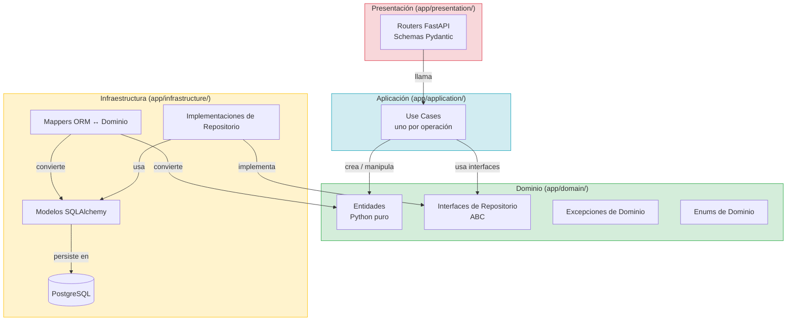

> **Regla absoluta:** las flechas de dependencia solo apuntan hacia adentro.
> `Presentation → Application → Domain ←← Infrastructure`
> La capa de Infraestructura implementa interfaces definidas en el Dominio (inversión de dependencias).

---

## 2. Módulos del Sistema

El backend se divide en **10 módulos funcionales** más un conjunto de componentes transversales.

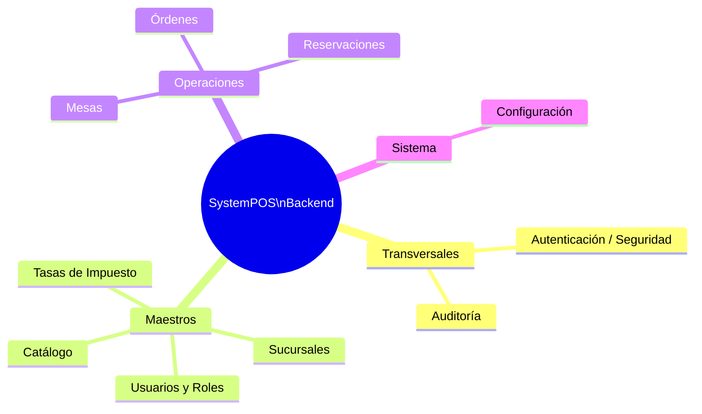

---

## 3. Mapa de Dependencias entre Módulos

Muestra qué módulo necesita conocer a otros dentro de la **capa de aplicación** (use cases que consumen repositorios de otros módulos).

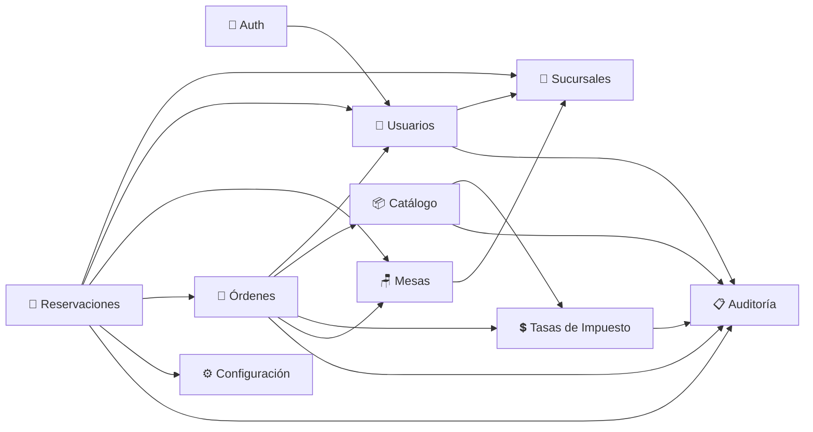

> Los módulos **Auth** y **Auditoría** son transversales: Auth es consumido por casi todos los endpoints; Auditoría es producida por casi todos los use cases.

---

## 4. Módulos en Detalle

---

### 4.1 Módulo Auth

Responsabilidad única: verificar la identidad de un usuario y emitir credenciales de sesión.

Soporta dos flujos de autenticación completamente independientes:

| Flujo | Quién lo usa | Mecanismo |
|---|---|---|
| **PIN (6 dígitos)** | Meseros / Managers en terminal POS (tablet) | bcrypt hash del PIN → JWT de corta duración |
| **Email + Password** | Admin / Manager en Dashboard Web | bcrypt hash del password → JWT de mayor duración |

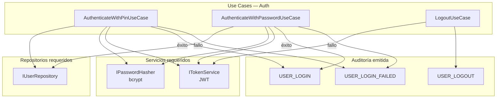

**Reglas de dominio relevantes:**
- Un usuario con `is_active = False` no puede autenticarse (en ningún flujo).
- El PIN nunca se compara en texto plano; siempre via `bcrypt.checkpw`.
- El `ITokenService` es una interfaz definida en el Dominio; su implementación JWT vive en Infraestructura.

---

### 4.2 Módulo Usuarios y Roles

Gestión del ciclo de vida de los usuarios del sistema. Los roles son catálogo fijo (`ADMIN`, `MANAGER`, `WAITER`).

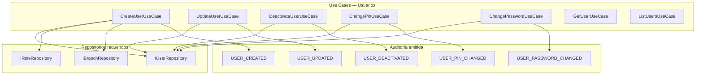

**Reglas de dominio relevantes:**
- Nunca se hace hard-delete de un usuario; solo `is_active = False` (`DeactivateUserUseCase`).
- `email` y `password_hash` son opcionales: un mesero que solo usa PIN no necesita ninguno de los dos.
- La unicidad de `email` (cuando no es null) y de `pin_hash` se verifica antes del INSERT.

---

### 4.3 Módulo Sucursales

Administración de las sucursales del negocio. Habilita que el sistema escale de un restaurante a una cadena sin rediseño.

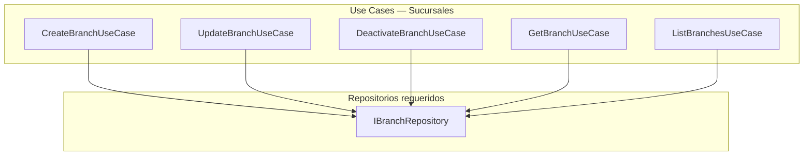

**Reglas de dominio relevantes:**
- `is_active = False` desactiva la sucursal sin borrarla (preserva integridad referencial con mesas, órdenes y reservaciones).
- No se puede eliminar una sucursal que tenga mesas activas (`RESTRICT` a nivel de FK).

---

### 4.4 Módulo Catálogo

Gestión del menú: categorías, productos y modificadores. Es el módulo de datos maestros central para las operaciones.

```mermaid
flowchart TD
    subgraph UC_CATALOG["Use Cases — Catálogo"]
        direction TB
        subgraph CAT["Categorías"]
            UC1[CreateCategoryUseCase]
            UC2[UpdateCategoryUseCase]
            UC3[ListCategoriesUseCase]
        end
        subgraph PROD["Productos"]
            UC4[CreateProductUseCase]
            UC5[UpdateProductUseCase]
            UC6[UpdateProductPriceUseCase]
            UC7[ToggleProductAvailabilityUseCase]
            UC8[ListProductsByCategoryUseCase]
        end
        subgraph MOD["Modificadores"]
            UC9[CreateModifierUseCase]
            UC10[UpdateModifierUseCase]
            UC11[DeleteModifierUseCase]
        end
    end

    subgraph REPOS["Repositorios requeridos"]
        R1[ICategoryRepository]
        R2[IProductRepository]
        R3[IModifierRepository]
        R4[ITaxRateRepository]
    end

    subgraph AUDIT_OUT["Auditoría emitida"]
        A1[CATEGORY_CREATED / CATEGORY_UPDATED]
        A2[PRODUCT_CREATED / PRODUCT_UPDATED\nPRODUCT_PRICE_UPDATED / PRODUCT_TOGGLED]
        A3[MODIFIER_CREATED / MODIFIER_UPDATED / MODIFIER_DELETED]
    end

    UC1 --> R1
    UC4 --> R2
    UC4 --> R1
    UC4 --> R4
    UC9 --> R3
    UC9 --> R2

    CAT --> A1
    PROD --> A2
    MOD --> A3
```

**Reglas de dominio relevantes:**
- `base_price` y `extra_price` usan `Decimal`, nunca `float`.
- `sort_order` es opcional; sin él el orden queda determinado por el ID de inserción.
- `DeleteModifierUseCase`: usa `RESTRICT` — no se puede borrar un modificador con historial en órdenes. Se lanza una excepción de dominio si aplica.
- `UpdateProductPriceUseCase` emite un audit event específico (`PRODUCT_PRICE_UPDATED`) con el precio anterior y el nuevo.

---

### 4.5 Módulo Tasas de Impuesto

Administración de las tasas fiscales aplicables a productos (ej. IVA 16%, Exento, IVA Reducido 8%).

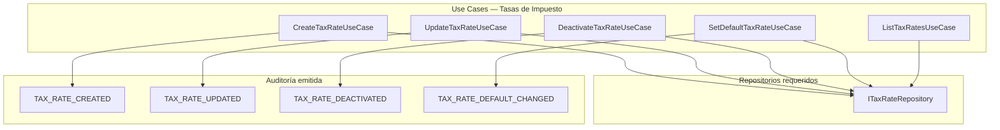

**Reglas de dominio relevantes:**
- Exactamente una tasa puede tener `is_default = True`. `SetDefaultTaxRateUseCase` quita el flag de la tasa anterior y lo asigna a la nueva en una transacción.
- No se puede desactivar la tasa por defecto sin antes designar otra como default.
- `rate` está en rango `[0.0000, 1.0000]` (0.1600 = 16%). Se valida en la entidad de dominio.

---

### 4.6 Módulo Mesas

Gestión de las mesas físicas por sucursal y su estado operativo en tiempo real.

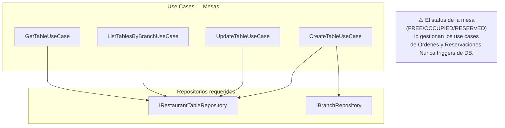

**Reglas de dominio relevantes:**
- `branch_id` es NOT NULL — toda mesa pertenece a una sucursal.
- El `status` (`FREE`, `OCCUPIED`, `RESERVED`) **no** se modifica directamente desde este módulo; es un efecto secundario de los módulos de Órdenes y Reservaciones.
- No existe un "DeleteTableUseCase" si la mesa tiene historial de reservaciones o de órdenes (`RESTRICT`).

---

### 4.7 Módulo Órdenes

Módulo operativo central. Gestiona todo el ciclo de vida de una orden, desde su apertura hasta el cobro.

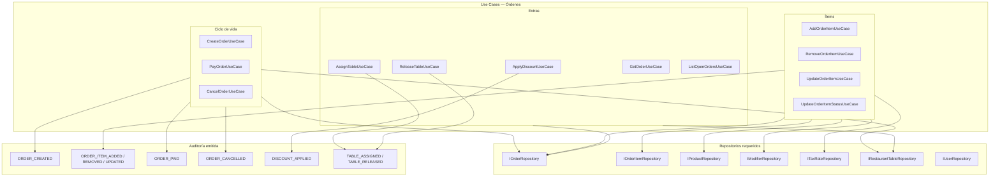

**Flujo de estados de una Orden:**

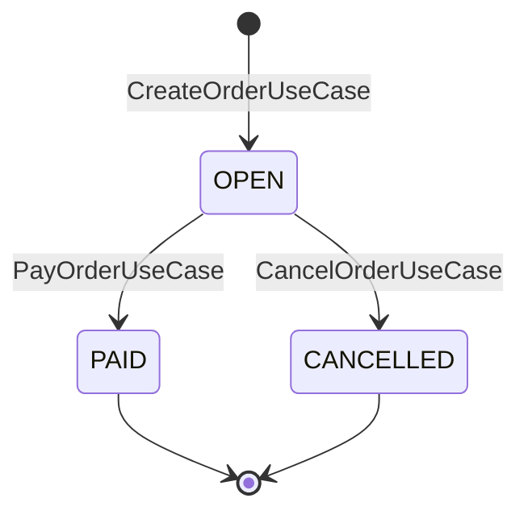

**Flujo de estados de un Ítem de Orden (KDS):**

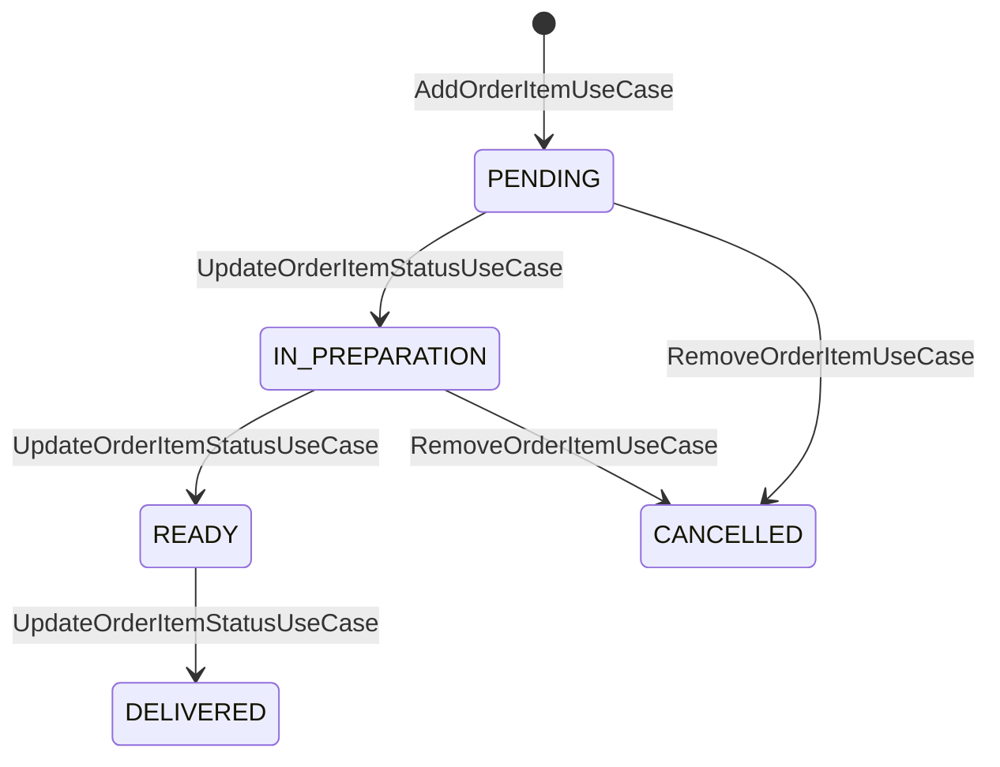

**Reglas de dominio relevantes:**
- Solo se pueden modificar ítems de una orden con `status = OPEN`. Una orden `PAID` o `CANCELLED` es inmutable.
- Al agregar un ítem (`AddOrderItemUseCase`): el use case resuelve la tasa de impuesto (del producto o la tasa default) y guarda el snapshot `unit_price` + `applied_tax_rate`. Nunca se guarda un FK al catálogo desde `ORDER_ITEM`.
- `total_amount` = `subtotal + taxes + tip - discount`. Se recalcula y persiste en cada modificación de la orden.
- Al pagar (`PayOrderUseCase`): se registra el `payment_method` y se liberan las mesas (`restaurant_table.status = FREE`).
- `ApplyDiscountUseCase` solo lo pueden ejecutar roles `ADMIN` o `MANAGER`.

---

### 4.8 Módulo Reservaciones

Gestión de reservaciones de mesas: creación, modificación, llegada del comensal y estados terminales.

```mermaid
flowchart TD
    subgraph UC_RES["Use Cases — Reservaciones"]
        UC1[CreateReservationUseCase]
        UC2[UpdateReservationUseCase]
        UC3[CancelReservationUseCase]
        UC4[SeatReservationUseCase]
        UC5[MarkNoShowUseCase]
        UC6[ListReservationsByBranchUseCase]
        UC7[GetReservationUseCase]
    end

    subgraph REPOS["Repositorios requeridos"]
        R1[IReservationRepository]
        R2[IRestaurantTableRepository]
        R3[IOrderRepository]
        R4[ISystemConfigRepository]
    end

    subgraph AUDIT_OUT["Auditoría emitida"]
        A1[RESERVATION_CREATED]
        A2[RESERVATION_UPDATED]
        A3[RESERVATION_CANCELLED]
        A4[RESERVATION_SEATED]
        A5[RESERVATION_NO_SHOW]
    end

    UC1 --> R1
    UC1 --> R2
    UC1 --> R4
    UC2 --> R1
    UC2 --> R2
    UC2 --> R4
    UC3 --> R1
    UC3 --> R2
    UC4 --> R1
    UC4 --> R2
    UC4 --> R3
    UC5 --> R1
    UC5 --> R2
    UC6 --> R1
    UC7 --> R1

    UC1 --> A1
    UC2 --> A2
    UC3 --> A3
    UC4 --> A4
    UC5 --> A5
```

**Flujo de estados de una Reservación:**

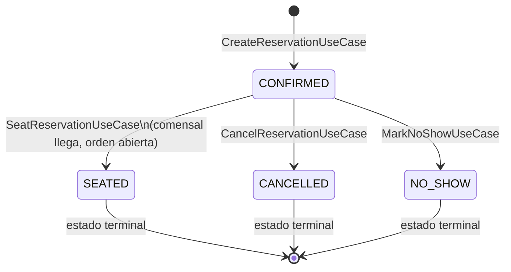

**Reglas de dominio relevantes:**
- `CreateReservationUseCase` valida solapamiento: no puede existir otra reservación `CONFIRMED` para las mismas mesas en el intervalo `[scheduled_at, scheduled_at + duration_minutes]`.
- Si `scheduled_at` cae dentro del umbral `reservation_upcoming_threshold_minutes` (leído de `SYSTEM_CONFIG`), el use case actualiza `restaurant_table.status = RESERVED`.
- `SeatReservationUseCase`: crea una nueva `Order`, la enlaza en `reservation.order_id`, y actualiza `restaurant_table.status = OCCUPIED`.
- `CancelReservationUseCase` y `MarkNoShowUseCase` reevalúan si hay otras reservaciones próximas para las mesas; si no las hay, las liberan (`FREE`).
- Los estados `SEATED`, `CANCELLED`, `NO_SHOW` son **terminales** — validado en la entidad de dominio `Reservation`, no en la base de datos.

---

### 4.9 Módulo Auditoría

Módulo de solo-escritura desde la perspectiva de los use cases. Registra todas las acciones relevantes del sistema.

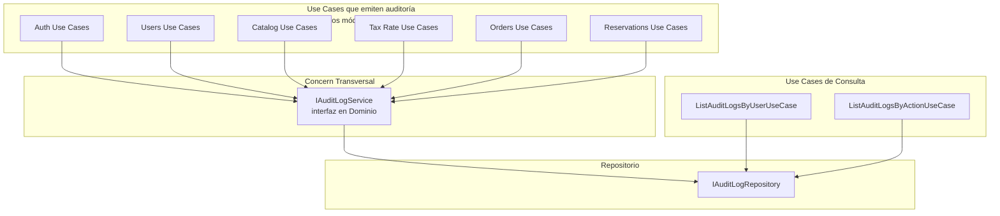

**Reglas de dominio relevantes:**
- El `IAuditLogService` recibe siempre: `user_id`, `action: AuditAction` (enum), y un `details: dict` opcional.
- `details` se almacena como `JSONB` en PostgreSQL — permite queries como `details->>'order_id'`.
- Los registros de auditoría son inmutables: no existe un `UpdateAuditLogUseCase` ni `DeleteAuditLogUseCase`.

---

### 4.10 Módulo Configuración del Sistema

Tabla de pares clave-valor para configuración del negocio que no justifica columnas propias.

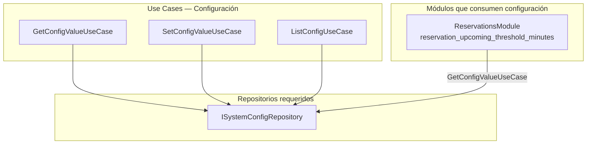

**Claves de configuración iniciales:**

| Clave | Ejemplo | Descripción |
|---|---|---|
| `suggested_tip_1` | `10` | Propina sugerida 1 (%) |
| `suggested_tip_2` | `15` | Propina sugerida 2 (%) |
| `suggested_tip_3` | `20` | Propina sugerida 3 (%) |
| `business_name` | `Restaurante El Sabor` | Nombre para facturas |
| `business_rfc` | `REST123456ABC` | RFC fiscal |
| `business_address` | `Calle Morelos 42, CDMX` | Dirección fiscal |
| `reservation_upcoming_threshold_minutes` | `30` | Minutos antes de la reserva para cambiar mesa a `RESERVED` |

---

## 5. Estructura de Archivos Propuesta

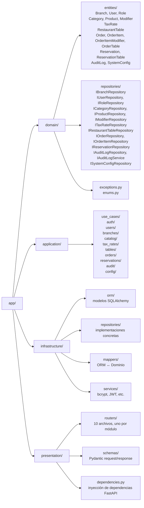

---

## 6. Resumen de Interfaces de Repositorio

| Interfaz | Módulo | Métodos principales |
|---|---|---|
| `IBranchRepository` | Sucursales | `save`, `find_by_id`, `find_all`, `update` |
| `IUserRepository` | Usuarios | `save`, `find_by_id`, `find_by_pin_hash`, `find_by_email`, `find_all_by_branch`, `update` |
| `IRoleRepository` | Usuarios | `find_by_name`, `find_all` |
| `ITaxRateRepository` | Tasas | `save`, `find_by_id`, `find_default`, `find_all`, `update` |
| `ICategoryRepository` | Catálogo | `save`, `find_by_id`, `find_all`, `update` |
| `IProductRepository` | Catálogo | `save`, `find_by_id`, `find_by_category`, `update` |
| `IModifierRepository` | Catálogo | `save`, `find_by_product`, `find_by_id`, `update`, `delete` |
| `IRestaurantTableRepository` | Mesas | `save`, `find_by_id`, `find_by_branch`, `find_by_ids`, `update_status`, `update` |
| `IOrderRepository` | Órdenes | `save`, `find_by_id`, `find_open_by_branch`, `update` |
| `IOrderItemRepository` | Órdenes | `save`, `find_by_order`, `find_by_id`, `update`, `delete` |
| `IReservationRepository` | Reservaciones | `save`, `find_by_id`, `find_by_branch_and_date`, `find_confirmed_overlapping`, `update` |
| `IAuditLogRepository` | Auditoría | `save`, `find_by_user`, `find_by_action` |
| `ISystemConfigRepository` | Configuración | `find_by_key`, `find_all`, `save_or_update` |

---

## 7. Seguridad y Control de Acceso

El control de acceso se aplica en la **capa de presentación** (dependencias FastAPI) basándose en el rol del usuario autenticado extraído del JWT.

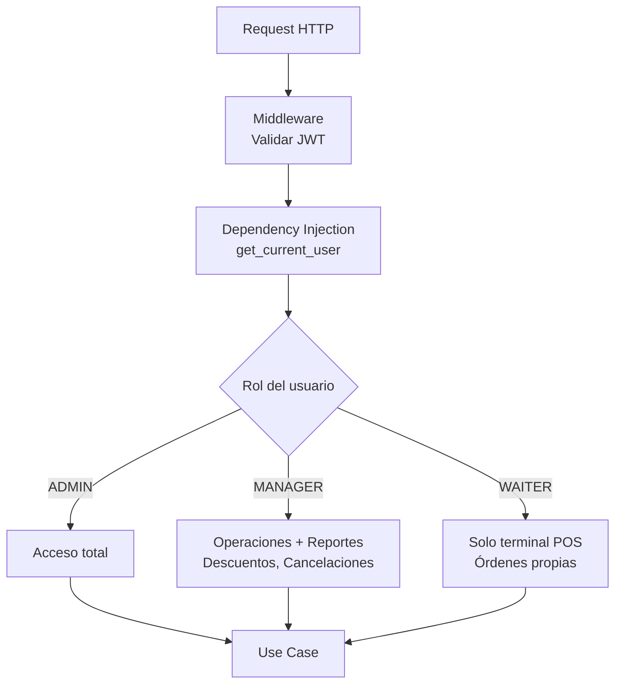

| Acción | ADMIN | MANAGER | WAITER |
|---|---|---|---|
| Gestionar usuarios / sucursales | ✅ | ❌ | ❌ |
| Gestionar catálogo / impuestos | ✅ | ❌ | ❌ |
| Ver reportes de auditoría | ✅ | ✅ | ❌ |
| Cancelar órdenes | ✅ | ✅ | ❌ |
| Aplicar descuentos | ✅ | ✅ | ❌ |
| Crear órdenes / tomar pedidos | ✅ | ✅ | ✅ |
| Crear / gestionar reservaciones | ✅ | ✅ | ✅ |
| Ver mesas de su sucursal | ✅ | ✅ | ✅ |

---

## 8. Control de Desarrollo

### Estado general por módulo

| Módulo | Dominio | Aplicación | Infraestructura | Presentación | Notas |
|---|---|---|---|---|---|
| **Foundation** (enums, excepciones) | ✅ | — | — | — | `app/domain/enums.py`, `app/domain/exceptions.py` |
| **Roles** | ✅ | — | ✅ | — | Solo lectura (catálogo fijo). Sin endpoints propios; se consume desde Usuarios |
| **Sucursales** | ✅ | ✅ | ✅ | ✅ | CRUD completo. `DELETE` hace soft-delete (`is_active=False`) |
| **Usuarios** | ✅ | ✅ | ✅ | ✅ | CRUD + change-pin + change-password. Soft-delete. Dual auth (PIN / email+password) |
| **Auth** | ✅ | ✅ | ✅ | ✅ | JWT diferenciado: PIN → 480 min, Password → 60 min |
| **Auditoría** | ✅ | — | ✅ | — | `IAuditLogService` inyectado en use cases. Sin endpoints de consulta aún |
| **Catálogo** | ✅ | ✅ | ✅ | ✅ | CRUD completo. Categorías (con description, sort_order), Productos (con toggle-availability, price update), Modificadores (con RESTRICT en delete). Prefijo `/catalog` |
| **Tasas de Impuesto** | ✅ | ✅ | ✅ | ✅ | CRUD completo + set-default. Soft-delete. Guarda `is_default` swap atómico vía `clear_default()` |
| **Mesas** | ✅ | ✅ | ✅ | ✅ | CRUD completo (sin delete). Status gestionado por Órdenes/Reservaciones. Prefijo `/tables` |
| **Órdenes** | ❌ | ❌ | ❌ | ❌ | Pendiente |
| **Reservaciones** | ❌ | ❌ | ❌ | ❌ | Pendiente |
| **Configuración** | ❌ | ❌ | ❌ | ❌ | Pendiente. Requerida por Reservaciones (`reservation_upcoming_threshold_minutes`) |

---

### Sesión 1 — 2026-04-02

**Alcance:** Bloque base (Foundation + Roles + Sucursales + Usuarios + Auth + Auditoría parcial)

**Archivos generados:** 68 archivos Python

**Stack definido:**
- Framework: FastAPI
- ORM: SQLAlchemy 2.x (sync, `DeclarativeBase`)
- DB driver: psycopg2-binary
- Hashing: passlib[bcrypt]
- JWT: python-jose[cryptography]
- Validación: Pydantic v2 con `pydantic[email]`
- Config: pydantic-settings (`.env`)

**Decisiones de diseño tomadas:**

| Decisión | Detalle |
|---|---|
| `User.role_name: RoleName` en entidad | Denormalizado para evitar un lookup extra en auth. Mapeador lo popula via JOIN en ORM (`lazy="joined"` en `UserORM.role`) |
| Login por PIN requiere `user_id` + PIN | En terminal POS el usuario selecciona su perfil de una lista, luego ingresa PIN. Evita iterar bcrypt para todos los usuarios |
| JWT con TTL diferenciado | PIN (POS) → 480 min. Email+password (Dashboard) → 60 min. Flag `pin_based` en `ITokenService.create_access_token` |
| `actor_user_id` inyectado en use cases de escritura | Use cases que emiten auditoría reciben el UUID del usuario autenticado vía constructor (no vía contexto global) |
| UUIDs almacenados como `VARCHAR` en ORM | `PG_UUID(as_uuid=False)` para compatibilidad. Conversión a `uuid.UUID` en mappers |
| Logout stateless | JWT no se invalida en servidor (sin blacklist). Use case solo emite `USER_LOGOUT` en auditoría |

**Endpoints disponibles:**

```
POST   /auth/pin                         → TokenResponse
POST   /auth/password                    → TokenResponse
POST   /auth/logout                      → 204

GET    /branches/                        → list[BranchResponse]   (cualquier rol autenticado)
POST   /branches/                        → BranchResponse 201     (ADMIN)
GET    /branches/{id}                    → BranchResponse         (cualquier rol autenticado)
PATCH  /branches/{id}                    → BranchResponse         (ADMIN)
DELETE /branches/{id}                    → 204 soft-delete        (ADMIN)

GET    /users/?branch_id=               → list[UserResponse]     (cualquier rol autenticado)
POST   /users/                           → UserResponse 201       (ADMIN)
GET    /users/{id}                       → UserResponse           (cualquier rol autenticado)
PATCH  /users/{id}                       → UserResponse           (ADMIN)
DELETE /users/{id}                       → 204 soft-delete        (ADMIN)
POST   /users/{id}/change-pin            → 204                    (propio o ADMIN)
POST   /users/{id}/change-password       → 204                    (propio o ADMIN)

GET    /health                           → {"status": "ok"}
```

---

### Pendiente para próximas sesiones

**Bloque 2 — Catálogo + Tasas de Impuesto**
- Módulos: `Tasas de Impuesto` y `Catálogo` (Categorías, Productos, Modificadores)
- Dependencia entre sí: Catálogo consume `ITaxRateRepository`
- Incluye use case especial `SetDefaultTaxRateUseCase` (transacción: quitar flag anterior, asignar nuevo)
- Incluye `DeleteModifierUseCase` con validación RESTRICT (excepción de dominio si hay historial)

**Bloque 3 — Mesas + Configuración**
- `Configuración` es prerequisito de Reservaciones (`reservation_upcoming_threshold_minutes`)
- Mesas: sin `DeleteTableUseCase` si hay historial. Status lo gestionan Órdenes y Reservaciones

**Bloque 4 — Órdenes**
- Use case más complejo: snapshot de precios + resolución de tasa de impuesto en `AddOrderItemUseCase`
- Recálculo de `total_amount` en cada modificación
- KDS: `UpdateOrderItemStatusUseCase` con máquina de estados

**Bloque 5 — Reservaciones**
- Validación de solapamiento de franjas en dominio (no en DB)
- `SeatReservationUseCase`: crea Order, enlaza `reservation.order_id`, actualiza estado de mesas
- Umbral `reservation_upcoming_threshold_minutes` leído de `SYSTEM_CONFIG`

**Bloque 6 — Endpoints de Auditoría + Seeds de roles**
- `GET /audit-logs?user_id=` y `GET /audit-logs?action=`
- Script o migration para insertar roles fijos (`ADMIN`, `MANAGER`, `WAITER`) en tabla `role`
